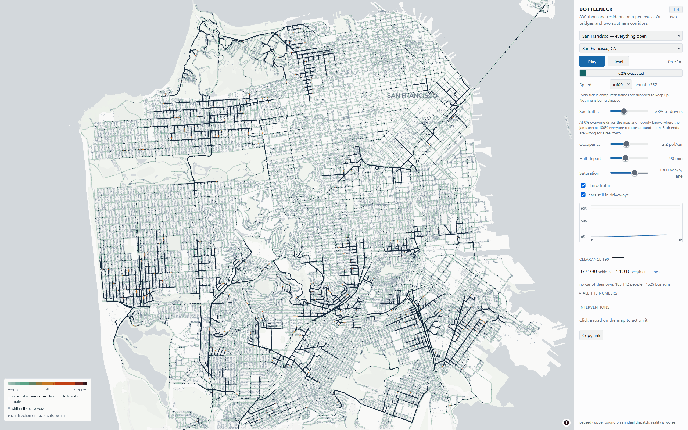

# Bottleneck

**Bottleneck is an interactive tool for testing city evacuation plans.** It shows how traffic
moves, where queues form, and how road changes affect evacuation time.

## Demo video

### [Watch the Bottleneck demo on YouTube](https://www.youtube.com/watch?v=mi8d-WwaxR8)

## Live demo

### [Open Bottleneck in your browser](https://roman-postnov.github.io/bottleneck/)

  
  ·
  <a href="LICENSE">MIT License</a>

  

### Explore the demo

1. Open the [live demo](https://roman-postnov.github.io/bottleneck/).
2. San Francisco opens first; press **Play**.
3. Watch individual cars, queues, spillback, and the clearance curve evolve together.
4. Click a road to inspect its capacity and load, or a car to follow its route out.
5. Switch to **Mercer Island** and the **Florida Keys** to see how network shape changes the result.

An intervention is applied at the simulated minute when it happens. This makes it possible to
test a response during an event, not only before the run begins.

## The problem

A static evacuation map shows possible routes, but it does not show whether those routes have
enough capacity, where queues will spill back, or how a road change will affect the result.
Bottleneck combines a real road network with a traffic simulation to answer three questions:

- How quickly can the city move its vehicles out?
- Where do queues form when capacity is exceeded?
- How do closures, extra lanes, contraflow, and routing information change the outcome?

Bottleneck is designed for screening, comparison, and discussion. It makes the assumptions
behind each result visible instead of presenting a precise-looking number as a forecast.

### Real places, real questions

| Case | Why it matters |
|---|---|
| **San Francisco, California** | A large network with alternative corridors, bridges, and non-obvious spare capacity. |
| **Mercer Island, Washington** | An island network where I-90 is the decisive way out. |
| **Florida Keys** | A long, nearly linear island chain controlled by a dominant highway. |
| **Paradise, California** | A documented historical case with timed closures and four arterial exits. |

Examples from the built-in scenarios:

- In **San Francisco**, the baseline run reaches T90 in 10 h 14 min; closing the Bay Bridge
  adds 2 h 05 min.
- On **Mercer Island**, the baseline reaches T90 in 2 h 49 min.
- In the **Florida Keys**, the baseline reaches T90 in 20 h 14 min, exposing the fragility of
  a long, nearly linear network.

These are scenario results, not emergency forecasts.

## How it works

~~~mermaid
flowchart LR
  A[OpenStreetMap data] --> B[Preprocessed city network]
  B --> C[Mesoscopic traffic simulation]
  B --> D[Max-flow and minimum cut]
  C --> E[Queues, spillback, and vehicles]
  C --> F[Clearance metrics]
  D --> G[Critical roads]
~~~

The simulation is mesoscopic: every road has a flow capacity and a storage limit, while nodes
resolve merges and diverges. This is detailed enough for queues and spillback to emerge from
the model, but compact enough to run an entire city in a browser.

The mathematical and transport models are explicit and testable:

- **Dinic max-flow and minimum cut** calculate the theoretical outbound ceiling and map it
  back to the roads that constrain every successful route. Capacities use whole vehicles per
  hour, so max-flow/min-cut equality is exact without a tuned floating-point tolerance.
- **Daganzo node model** distributes flow through merges and diverges using capacity-weighted
  proportional allocation with saturation. A blocked direction can hold back a shared
  approach, allowing spillback to propagate through the network.
- **Reverse Dijkstra and multinomial logit routing** build routes from every node toward the
  exits. Informed drivers can respond to observed queues while uninformed drivers continue to
  price routes by free-flow travel time.
- **Rayleigh mobilisation curve** releases household demand over time in closed form, keeping
  departures tied to the population mass balance.
- **Newell cumulative-count trajectories** place each visible car from the simulation's own
  edge counts. One dot represents one car rather than a decorative traffic particle.
- **Seeded xorshift128+ randomness** makes every scenario deterministic: identical inputs
  reproduce the same run, comparison, and shared link.

Road edits are time-stamped and rebuild the affected network state. The simulation then reports
T90 clearance time, peak outbound flow, queues, spillback, stranded vehicles, and efficiency
against the max-flow ceiling.

### Architecture

~~~text
src/core      Pure traffic and graph models over typed arrays
    ↓
src/worker    Simulation lifecycle and browser message boundary
    ↓
src/main      Application state and worker coordination
    ├── src/ui       React controls and metrics
    └── src/render   MapLibre and deck.gl visualisation

tools         Offline OpenStreetMap extraction and preprocessing
~~~

The simulation runs in a Web Worker so map interaction remains responsive. Frames do not pass
through React; only throttled summaries update the interface. Import restrictions, shared
protocol types, deterministic tests, and a single reader/writer definition for the binary city
format enforce the architectural boundaries.

## Tech stack

| Area | Technology |
|---|---|
| Application | TypeScript, React, Vite |
| Simulation | Web Workers, typed arrays, deterministic mathematical models |
| Mapping | MapLibre GL, deck.gl |
| Road and population data | OpenStreetMap, Geofabrik extracts, documented NIST and U.S. Census inputs |
| Offline data pipeline | Python, pyosmium, TypeScript |
| Quality | TypeScript strict checks, Biome, Vitest |
| Hosting and delivery | GitHub Actions, GitHub Pages |
| AI-assisted development | OpenAI Codex with GPT-5.6 Sol; Claude Code with Claude Opus 5 |

OpenAI Codex with GPT-5.6 Sol and Claude Code with Claude Opus 5 were used for implementation,
code review, testing, and documentation. Bottleneck's traffic engine is a deterministic
mathematical model rather than a generative AI model.

The deployed application is a static site. The city data ships with it, and the simulation runs
locally in the user's browser; no application server is required.

## Validation and limitations

Validation ranges were written before running the model. A target that the model misses remains
an explicitly named expected failure instead of being moved to fit the result. Tests cover mass
conservation, capacity, routing, determinism, graph invariants, time-stamped edits, visual car
counts, and real-city scenario checks.

The Paradise case correctly identifies the four documented escape arteries, but the simulated
fire-closure scenario clears earlier than the historical target. The closure schedule is
simplified, and closing a road does not model fire spread or the disruption to vehicles already
on it. This known miss is retained as part of the validation record.

Bottleneck models vehicle evacuation inside a selected boundary and treats crossing that
boundary as success. It does not model:

- fire spread or other evolving hazards;
- pedestrians, public transport, or household-level decisions;
- neighbouring traffic outside the selected boundary;
- travel from the boundary to a genuinely safe destination.

The resulting clearance times are deliberately idealised and optimistic. Compare scenarios and
interventions; do not use a single run as an operational emergency forecast.

## Technical documentation

- [Technical contracts](docs/CONTRACTS.md) describe the data format, traffic model, worker
  protocol, rendering pipeline, and engineering invariants.
- [Model validation](docs/VALIDATION.md) records the targets, evidence, results, and known misses
  for the built-in cities.
- [Model limitations](docs/LIMITATIONS.md) explains what the model leaves out and how each
  simplification can affect the result.

## Running it locally

The repository includes four prebuilt city networks and ready-to-run scenarios, so the demo
does not require a data download. Use Node.js 24, which is also used by CI:

~~~sh
npm ci
npm run dev
~~~

Build and preview the production bundle:

~~~sh
npm run build
npm run preview
~~~

Run type checks, linting, and the test suite:

~~~sh
npm run check
~~~

Rebuild a city from raw OpenStreetMap data

The offline pipeline downloads Geofabrik extracts, converts them to intermediate data, and
builds the binary city network used by the browser:

~~~sh
python3 -m venv tools/.venv
tools/.venv/bin/pip install -r tools/requirements.txt
data/raw/fetch.sh
npm run extract -- <cityId>
npm run preprocess -- <cityId>
~~~

The prebuilt networks remain available, so this is only necessary when changing the source data
or preprocessing rules.

## Data and attribution

- Road geometry and building footprints come from
  [OpenStreetMap](https://www.openstreetmap.org/copyright) extracts downloaded through
  [Geofabrik](https://download.geofabrik.de/).
- Population inputs come from the documented NIST and U.S. Census sources for each case.
- The basemap is provided by MapLibre and CARTO; attribution is shown in the application.
- Preprocessed city networks ship as static assets with the Pages deployment.

The code is available under the [MIT License](LICENSE).

## The team

**Roman Postnov — solo developer.** Product concept, mathematical modelling, data pipeline,
frontend, visualisation, validation, and deployment.
